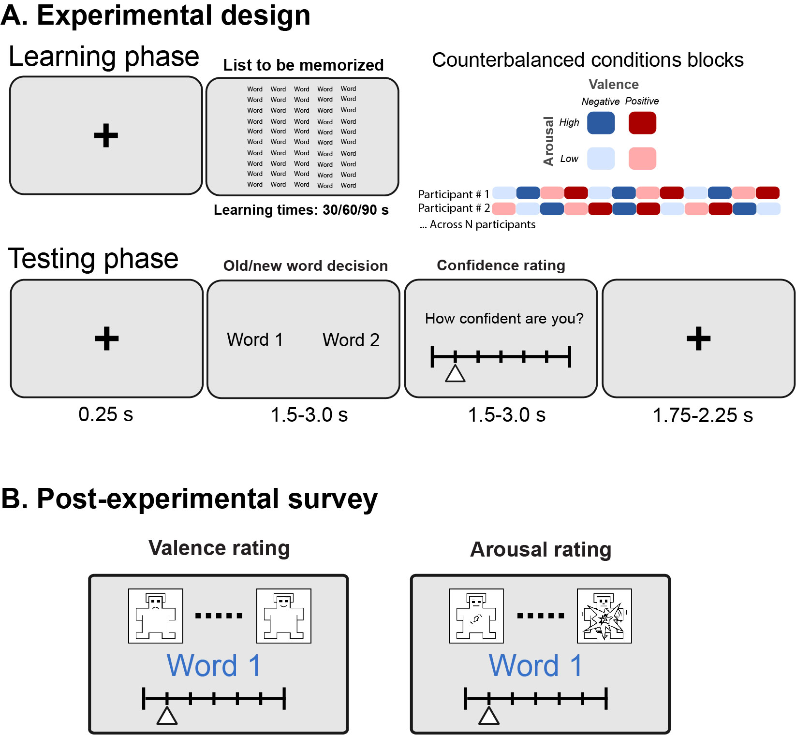
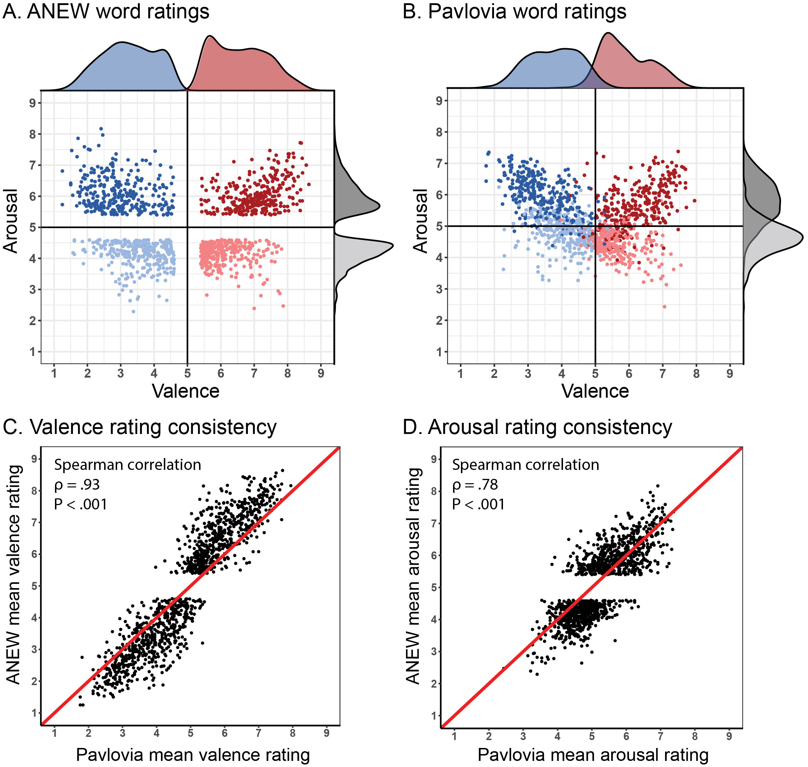
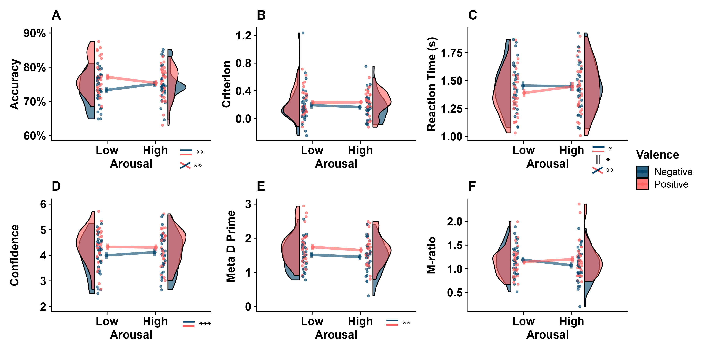
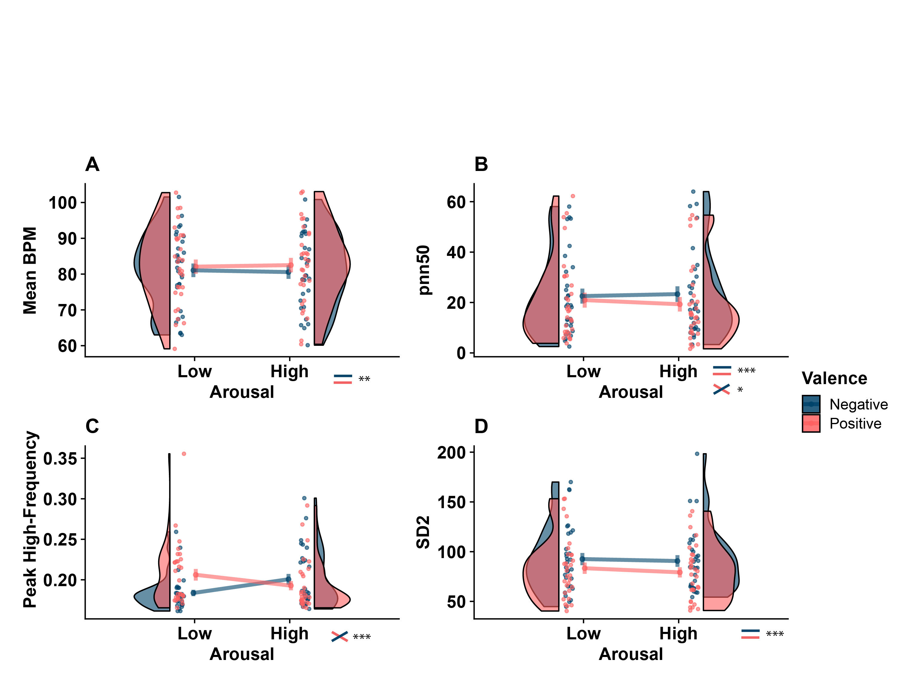

# Emotional valence and arousal influence metacognition for memory

Nicolas Legrand, Sebastian Scott Engen, Camile Correa, Nanna Kildahl Mathiasen, Niia Nikolova, Francesca Fardo, Micah Allen

This repository contains data, scripts and Jupyter notebook needed to reproduce analyses from the preprint version of the paper.

# Abstract

>Emotion biases both perception and decision making. In the domain of memory, the emotional valence and arousal of memorized stimuli can modulate both the acuity and content of episodic recall. However, no experiment has investigated whether arousal and valence also influence metacognition for memory (i.e. the process of self-monitoring memories). In a pre-registered study, we applied a novel psychophysiological design together with computational models of metacognition to assess the influence of stimulus valence and arousal on the sensitivity, bias, and efficiency of meta-memory. To assess the role of physiological arousal in mediating these effects, we recorded cardiac measures through pulse oximetry. We found that negative valence globally and substantially decreased both memory performance and subjective confidence, in particular for low-arousal words. Simultaneously, we found that emotional valence modulated both linear and non-linear metrics of high-frequency heart-rate variability (HRV), indicating a robust effect of negative valence on physiological arousal during recognition memory. Exploratory trial-level analyses further revealed that subjective confidence was significantly encoded in instantaneous heart-rate fluctuations, and this relationship was modulated by emotional valence. Our results demonstrate that both recognition memory and metacognition are influenced by the emotional contents of encoded items and that this correlation is in part related to cardiac activity.

# Data

Raw behavioral and physiological data are provided in the `Data/Raw` folder.

# Code

## Notebooks

Figures and statistical models can be reproduced via Jupyters Notebooks and Rmarkdow scripts.

* `1 - Behavioral.ipynb` will preprocess the behavioral data, plot and run stat models.
* `2 - EvokedPulseRate.ipynb` will extract and clean instantaneous pulse rate, save reports, plot and test results for Figure 3.
* `3 - Regressions.ipynb` will run the regression analysis for Figure 5.
* `4 - PulseRateVariability.ipynb` will extract HRV, plot and run stat model for Figure 4.

You can turn this repository into an interactive Binder session using this link: 

## Scripts

### Metacognition

* `sdt.py` Signal Detection Theory utilities.

* `metad.R` R script runing hierarchical estimation of meta-d' based on the method proposed by Fleming (2017). Adapted from: https://github.com/metacoglab/HMeta-d

# Figures

## Figure 1:

>**A.** Experimental design. The metamemory task contained 12 experimental blocks, each block consisted of a learning phase and a testing phase for the 50 words. . **B.** Post-experimental survey. Participants completed a short subject visual analogue scale rating of valence and arousal for the 1200 words used in the main task (600 target and 600 distractors). This was done in a web-based version of the original procedure used in the original ANEW survey.

## Figure 2:

>**Stimulus Selection and Rating Validation Study.** Two rating procedures were used to select word stimuli; the original ANEW and the PAVLOVIA that was made up of ratings from the participants. Each word was rated on a 9-point scale (1-9) for valence and arousal separately. **A & B**. We selected the words used in the metamemory task by removing items from the central tertile in the arousal and valence rating distributions. This was performed to optimize the separation between the upper and lower clusters on both scales (**A.**). The blue and red dots represent words with negative and positive valence, respectively. The light and dark points represent low and high arousal, respectively. The densities represent the distribution for positive and negative valence (red and blue), and arousal (light and dark). Even though only the words in high and low categories from the ANEW were included in the analysis of the PAVLOVIA dataset, it appears that the ratings in the PAVLOVIA dataset are less distinct as more ratings are distributed close to the middle. **C & D**. We compared the independent rating provided by the ANEW database to the actual ratings provided by the participants, PAVLOVIA, after the main procedure. The black dots represent each word in the datasets and the red line shows the optimal correlation. The valence ratings (**C**) are closer to the identity line and thus they demonstrate better overall consistency than arousal (**D**). However, both ratings of valence and arousal showed reasonably high consistency. See online article for colour figures.

## Figure 3:

>Behavioural results showing factorial main effects and interactions on discrimination and metacognitive performance. Modified raincloud plots (Allen et al., 2019) illustrating behavioural results of discrimination measures of accuracy (**A.**), criterion (**B.**) and reaction time (**C.**) as well as metacognitive measures of confidence (**D.**), Meta-d’ (**E.**) and M-ratio (**F.**). Repeated measures ANOVA (Valence × Arousal) was carried out for each condition separately. The upper panel shows that a significant main effect of emotional valence was observed as negative valenced words reduced accuracy (**A.**) and slowed down reaction times (**C.**). Similarly, the lower panel shows a main effect of valence for both Confidence and Meta d’ are impaired by negative valence. (*** p<0.001, ** p<0.01, * p<0.05).

## Figure 4:

>Modified raincloud plots illustrating results of pulse rate variability. PRV indices were calculated separately for each 50 trial block and averaged by condition. Mean BPM (**A.**), Pnn50 (**B.**), High-frequency peak (**C.**), SD2 (**D.**). Repeated measures ANOVA (Valence × Arousal) was carried out for each condition separately. A significant main effect of emotional valence was observed for mean BPM, as negative valence decreased cardiac activity frequency, as well as for the pnn50 and the non-linear SD2 metric. We did not observe an influence of Arousal, but an interaction with valence was found for the high-frequency peak, such that high-frequency cardiac oscillations were reduced by negative emotional valence under low but not high arousal. No other significant effects were found. (*** p<0.001, ** p<0.01, * p<0.05). See Methods and PRV Results for more details.

## Figure 5:

>**Modulation of the cardiac activity at the trial level and its relation with reported subjective confidence. A.** Evoked pulse rate activity shows that the overall experimental procedure modulated the instantaneous cardiac frequency over time. We observed an early acceleration component after the trial start (0-2 s) and a later deceleration component (2-6 s). Previous studies already reported such a pattern, which is consistent with an orientation reflex. These two components also parallel the decision and metacognition components as reflected by the analysis of the response time. Here, we did not observe any overall between condition or interaction effects **B.** Using the same data, we averaged the instantaneous pulse rate in the window of interest (0-5 s) and confirmed this absence of effect and an overall diminution of cardiac frequency after the trial start. **C.** Beta values over time of the linear regression (Confidence ~ BPM) for positive and negative valence trials separately. The confidence level was associated with the instantaneous cardiac frequency during the late time window corresponding to the metacognition decision. **D.** Beta values over time of the linear regression (Confidence ~ BPM) for high and low arousal trials separately. Using the same approach, contrasting for High and Low level of arousal. Significance assessed using a cluster-level statistical permutation test (alpha=0.05). Shaded areas and error bar show the 68% CI. Significant clusters are shown by a shaded red path for condition contrast, and grey path for null tests.
